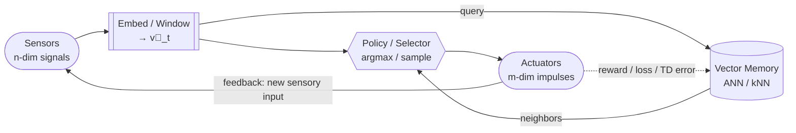

# VeCTRL
VeCTRL is a vector-driven control architecture for real-time agents. It combines high-dimensional sensory embeddings, memory-based retrieval, and adaptive action selection inside a closed-loop controller.

## Levels of Control
1. LLM Policy: Creates loss functions mapped to concrete goals ("move forward," "stop," "dance")
2. Online vector-based Q Learning for VeCTRL Core
3. Offline creation of new high-dimensional points for VeCTRL Core, allowing for adaptive pattern definition

## Control Loop

The core loop uses [Temporal Difference (TD)](https://en.wikipedia.org/wiki/Temporal_difference_learning) learning to optimize next action selection based on interaction with its environment.

The LLM planner selects the current state (ex: attacking, running, hiding...). The current state is represented as a vector of weights applied to sensory input. The goal is to optimize for different behaviors when in different states.

### Core Loop

        ┌────────────┐
        │  Sensors   │
        └─────┬──────┘
              │  n-dim vector
              ▼
        ┌────────────┐
        │  Embedding │
        │  / Memory  │◄───┐
        └─────┬──────┘    │
              │ kNN / ANN │ feedback
              ▼           │
        ┌────────────┐    │
        │ Action /   │────┘
        │ Control    │
        └─────┬──────┘
              │ m-dim impulses
              ▼
        ┌────────────┐
        │  Actuators │
        └────────────┘

### Outside the Loop

        ┌───────────┐
        │   LLM     │
        │ Planner   │
        └─────┬─────┘
              │
          (sets goals)
              │
        ┌─────▼─────┐
        │  VeCTRL   │  ← unchanged core
        └───────────┘

#### Skills

Skills can be considered "temporary operating regimes" for the core control loop. The core control loop always selects actions. The selected skill transforms the state + action selection + cost function update space.

> An LLM selecting skills every few seconds doesn’t interfere with in-the-loop action selection — it reshapes the **action space** and **learning dynamics** so that the fast loop selects a best action with intent, coherence, and safety.
